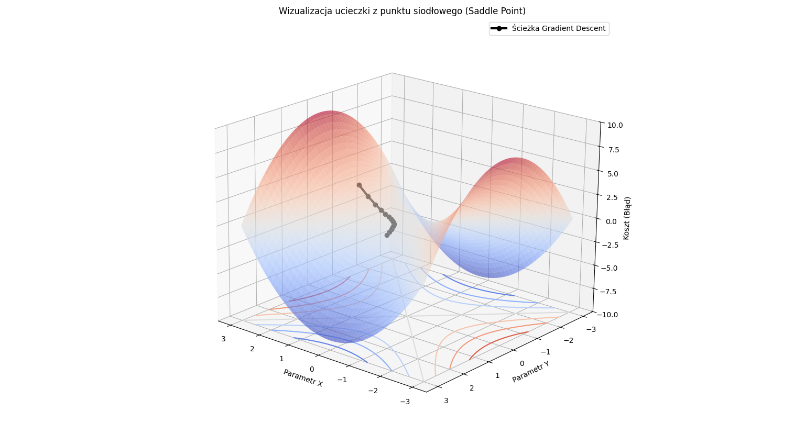

# Gradient Descent in a Saddle Point (3D Visualization

## 🎯 Cel projektu
Wizualizacja zachowania algorytmu Gradient Descent (spadku gradientu) w otoczeniu punktu siodłowego. Projekt pokazuje, jak algorytm "ucieka" z lokalnego płaskowyżu, co jest kluczowym zagadnieniem w uczeniu sieci neuronowych.

## 📊 Wynik działania
Poniżej wizualizacja 3D ścieżki algorytmu (czarna linia), który startuje blisko punktu siodłowego i przyspiesza w dół zbocza.

## 🛠️ Technologie
- **Python 3.x**
- **NumPy** (obliczenia macierzowe)
- **Matplotlib** (wizualizacja 3D)

## 🚀 Jak uruchomić?
1. Zainstaluj biblioteki: `pip install numpy matplotlib`
2. Uruchom skrypt: `python gradient_descent_saddle.py`
